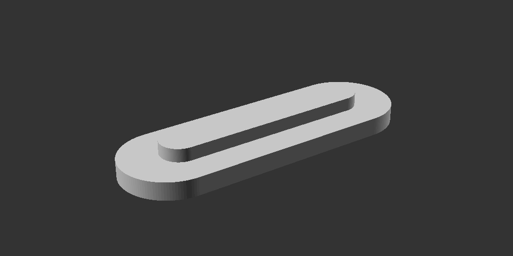
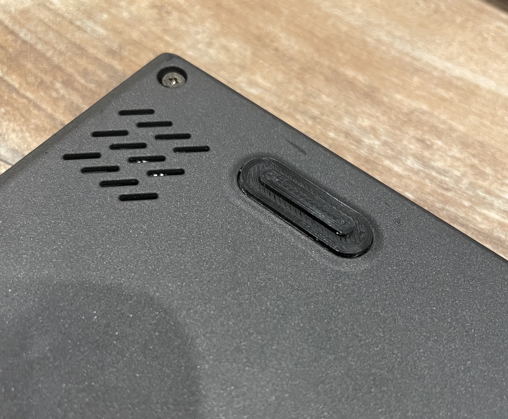

# X250-rubberfoot
3D model of the rubber feet of the ThinkPad X250.  
Acts as an 1:1 replacement and fits perfectly.  
Just add a little bit of glue. 
You need to install the BOSL-repo for Open-SCAD to modify the model.

Best print settings (PLA) :
- 210°C Hotend
- 50°C Bed
- 0.12 layer hight
- 100% infill

